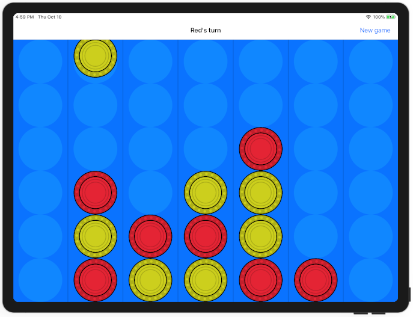
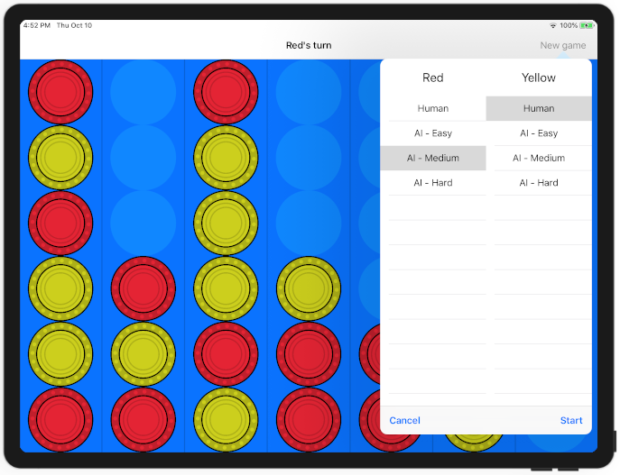

# Project 32

https://www.hackingwithswift.com/read/34/

Includes solutions to the [challenges](https://www.hackingwithswift.com/read/34/9/wrap-up).

## Topics

GameplayKit, AI, heuristic, UIStackView

## Challenges

From [Hacking with Swift](https://www.hackingwithswift.com/read/31/6/wrap-up):
>1. If you're looking to extend this project, the first thing you're likely to target is the heuristic function. As I said at the beginning, this project is based on some less-than-perfect Apple sample code, which I went on to rewrite in Swift, then refactor to make it easier to understand. The heuristic code is what makes the AI smart, but it doesn't take into account how many moves it takes for a win to happen, and so it performs fairly poorly.
>2. As for other improvements, you've seen how this game could work in one- or two-player modes, so you could easily add a user interface to let the player select what kind of game they wanted. Then, by adjusting the level of look ahead, you could implement Easy, Medium and Hard computer opponents.
>3. For a much easier improvement to make, you could switch out our UIView chips for UIImageViews, then draw your own red and black chip graphics. There isn't much coding required to make this happen, but let's face it: you've just written a mountain of code, so you probably deserve a break!

## Screenshots

